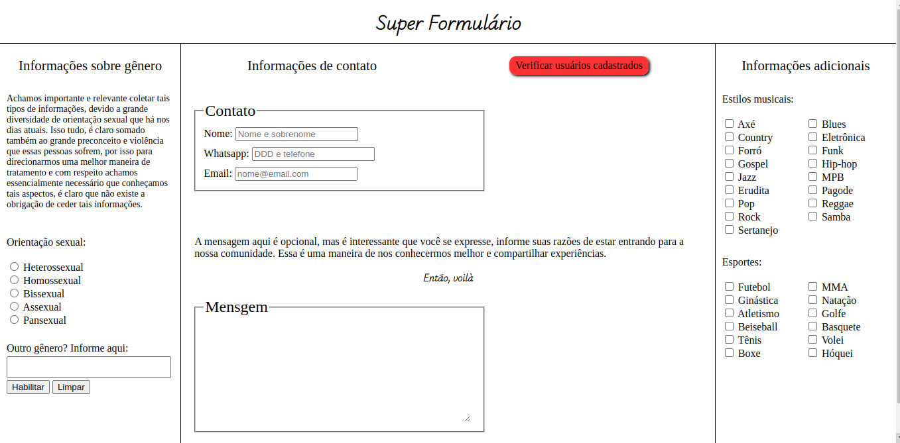

# super-form
Exemplo de formulário de inscrição, daqueles que ocupam todo o espação da tela com os mais váriados inputs. Se trata de uma demonstração, por isso os dados não são enviados
para o backend. É possível ver os dados salvos acionando o botão "verficar usuários cadastrados".

